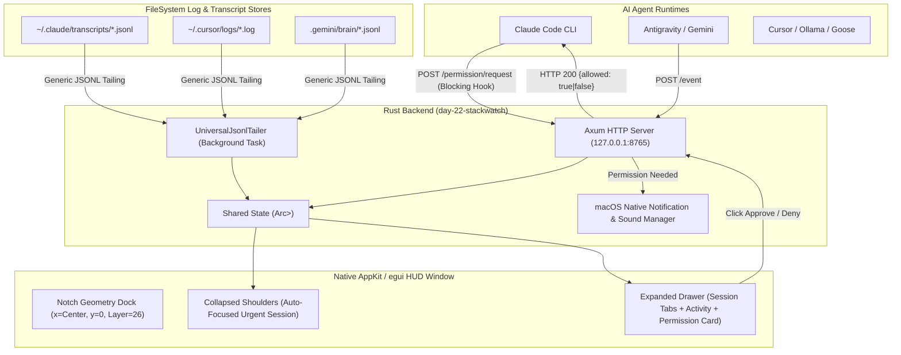

# Specification: Agent Notch Watcher (Day 22)

- **Target**: Day 22 monorepo challenge (`day-22-stackwatch`)
- **Stack**: Rust (`eframe`/`egui` + AppKit/`objc2` + Axum + `sysinfo` + `notify-rust`)
- **Design Paradigm**: Ponytail Minimal / High-Impact (Zero speculative trait abstractions; single generic JSONL tailer + standard HTTP IPC).

---

## 1. Executive Summary & Goals

The **Agent Notch Watcher** is a native macOS HUD that docks flush into the MacBook camera notch. It turns the dead screen real estate around the camera cutout into an active control center for local and remote AI agent sessions.

### The 3 Core Pillars:
1. **🚀 Launch New Agent Sessions**: A session launcher in the notch drawer to pick an agent binary (Claude Code, Antigravity, Cursor, Ollama, Goose, Aider, or custom commands), select a working directory, and spawn the process with HUD telemetry attached.
2. **👀 Watch Active Sessions**: Real-time auto-discovery and log tailing of running agent sessions via a `UniversalJsonlTailer` + HTTP state stream, presented in clean drawer session tabs (`[Claude: day-22]`, `[Antigravity: web]`).
3. **🔔 Interactive Permission Control & Alerts**: High-priority alert pipeline triggering a native macOS notification, sound chime, and glowing notch animation whenever an agent hits a permission gate (file edit, shell execution), offering direct **Approve** and **Deny** buttons in the notch drawer.

---

## 2. Architecture & Data Flow



---

## 3. Data Schemas & API Protocols

### 3.1 HTTP Endpoints (`127.0.0.1:8765`)

#### `POST /event`
Updates the telemetry state for a session.
```json
{
  "session_id": "claude-50-days",
  "agent_type": "anthropic",
  "status": "thinking",
  "step_description": "Analyzing src/lib.rs...",
  "tokens_used": 78400,
  "token_limit": 100000,
  "glow_setting": "max"
}
```

#### `POST /permission/request` (Blocking)
Sent by CLI hooks or agents when awaiting user approval. Blocks until user clicks **Approve** or **Deny** in the HUD.
```json
{
  "request_id": "perm-9812",
  "session_id": "claude-50-days",
  "agent_name": "Claude Code",
  "action_type": "file_edit",
  "details": "replace_file_content target=\"src/lib.rs\"",
  "timeout_seconds": 60
}
```
**Response (blocking HTTP return)**:
```json
{
  "request_id": "perm-9812",
  "allowed": true,
  "timestamp": 1785686423
}
```

#### `POST /session/launch`
Launches a new agent process from the HUD.
```json
{
  "agent_command": "claude",
  "working_directory": "/Users/tjlsmith0831/Desktop/Programming/50-days-of-dev",
  "initial_prompt": "Write unit tests for module X"
}
```

---

## 4. UI Specification (`eframe`/`egui`)

### 4.1 Window Positioning & AppKit Layering
- **Positioning**: Top-center (`x = (screen_width - hud_width) / 2`, `y = 0`).
- **Level**: Raised to `NSStatusWindowLevel + 1` (layer 26) via `objc2` to dock in front of the macOS menu bar.
- **Sizing**: Window bounds match exact content (`486x32` collapsed, `620x220` expanded) so transparent regions never swallow clicks.

### 4.2 Collapsed Shoulders Mode
- **Left Shoulder**: Auto-focuses on the session requiring urgent attention (e.g. `⚠️ Permission Request` or active thinking dot + agent name).
- **Right Shoulder**: Task summary snippet + chevron dropdown indicator.
- **Bottom Edge Gauge**: 2.5px token meter bar (green <75%, amber 75-90%, glowing red >90%).

### 4.3 Expanded Drawer Mode
- **Session Tab Strip**:
  - Displays tabs for all active sessions: `[Claude Code (day-22)]`, `[Antigravity (web)]`, `[Ollama (llama3)]`.
  - Right-aligned **`🚀 + Launch Session`** button opens the launcher modal.
- **Token Quota Card**: Displays tokens used vs limit, budget, and time until reset.
- **Live Task Log Stream**: Displays recent step events in monospace.
- **Interactive Permission Card**:
  - Highlights red/gold when permission is needed.
  - Prompts target action (e.g. `replace_file_content target="src/lib.rs"`).
  - Contains **Approve** (green) and **Deny** (red) buttons that resolve the pending HTTP request.

---

## 5. Ponytail Implementation Strategy

1. **`UniversalJsonlTailer`**: Single ~40-line background loop that scans active files in `~/.claude/`, `~/.cursor/`, `.gemini/`, `.aider/`. No complex regexes or per-agent adapter classes.
2. **Axum HTTP Server**: Route handlers for `/event`, `/permission/request`, and `/session/launch`.
3. **macOS Notification & Sound**: Fire `osascript -e 'display notification ... sound name "Glass"'` or `notify-rust` on permission request.
4. **`claude-notch-hook`**: 5-line bash script for Claude Code permission command integration.
